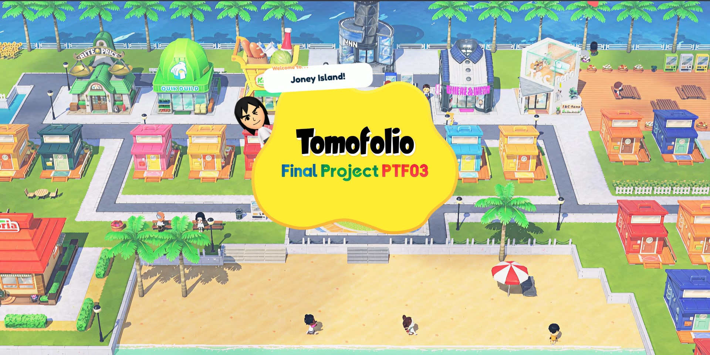

# Tomofolio

> **Final Project for PTF04**  
> *A playful, interactive portfolio website for the stuffs I made in PTF04!!!.*

---

## 📖 Overview

**Tomofolio** is a final project portfolio for PTF04 designed to showcase my activities in a fun way. Built with a "nintendo game" feel, and a cozy themed design!

This is deployed in tomofolio.netlify.app

---

## 🚀 How to Run

1. **Download or clone** this repository
2. Open `index.html` in your browser
3. Click **"▶ Play!"** on the splash screen
4. Wait 8 seconds for the **START** button to appear
5. Click **"▶ START"** to enter the main app

## Github Repo
https://github.com/unix-chewy/tomofolio.git